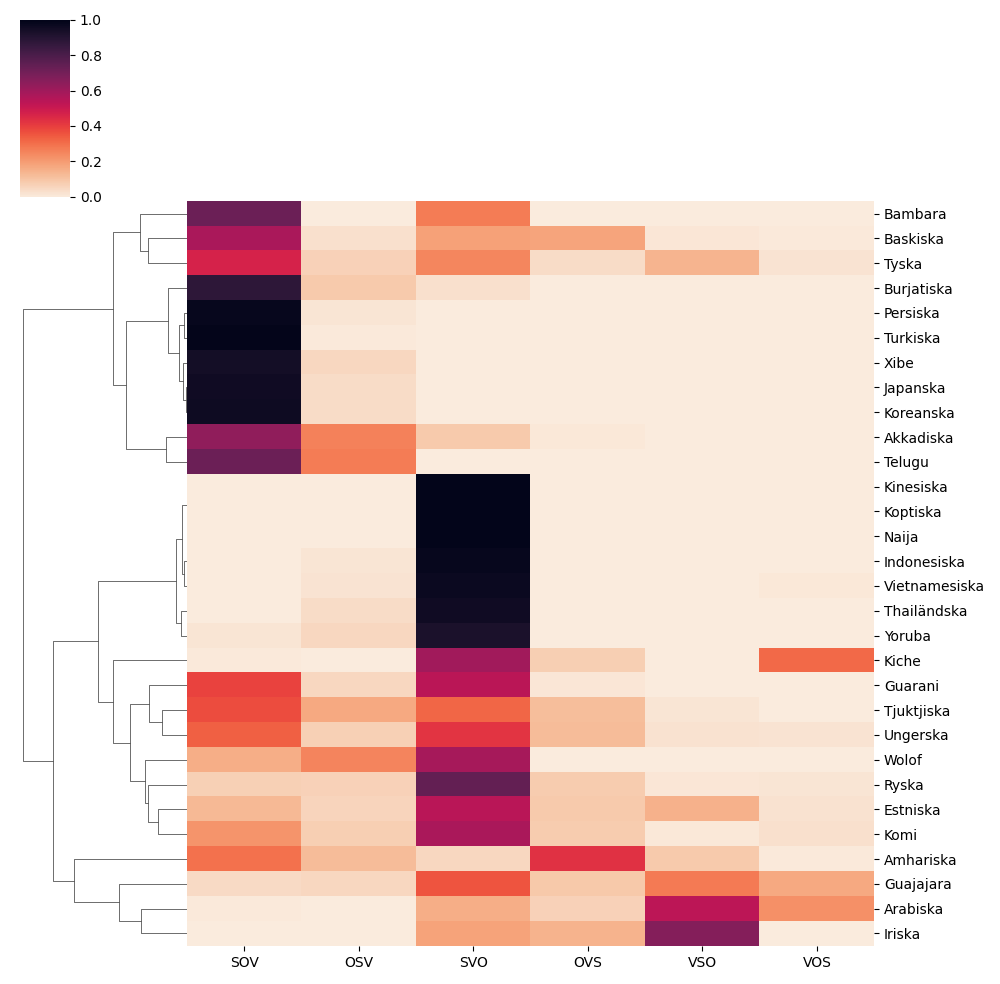

# Word order variation analysis

## Basic execution

To run the script, Python 3 is required, as is a copy of the [Universal Dependencies](https://universaldependencies.org/) database.

```
python3 analysis.py corpora.txt .
```

This performs some basic syntactic analysis on the CONLLU files listed in `corpora.txt`, with paths prefixed by `.` (if the database is locally stored elsewhere a different prefix may be used, e.g. `..`). For each corpus, all verbs are identified, and for each verb (V) its direct dependencies are identified. By default, only subjects (S) and direct objects (O) are considered.

## Command line options

The first command line argument after `analysis.py` must be a corpus collection file using the format of `corpora.txt`, and after that, a prefix for the paths in `corpora.txt` (e.g. `.` or `..`), but after that any of the following options may be specified. Four relate to the output:

- `-d`: prints the word order distribution for each analysed corpus.
- `-e`: prints a random sample of (up to) 5 examples for each identified word order, for each analysed corpus.
- `-h`: plots a clustered heatmap of the corpora's distributions over the most common word orders.
- `-f`: creates or overwrites the file `distributions.txt` with all distributional data collected by the script.

Three others relate to the analysis performed:

- `-x`: includes auxiliary verbs in the analysis (as X).
- `-i`: includes indirect objects in the analysis (as I).
- `-p`: removes clauses that are not a simple permutation of S, O, and V from the sample; incompatible with `-x` and `-i`.

## Result

The diagram produced with `python3 analysis.py corpora.txt . -p -h`:

